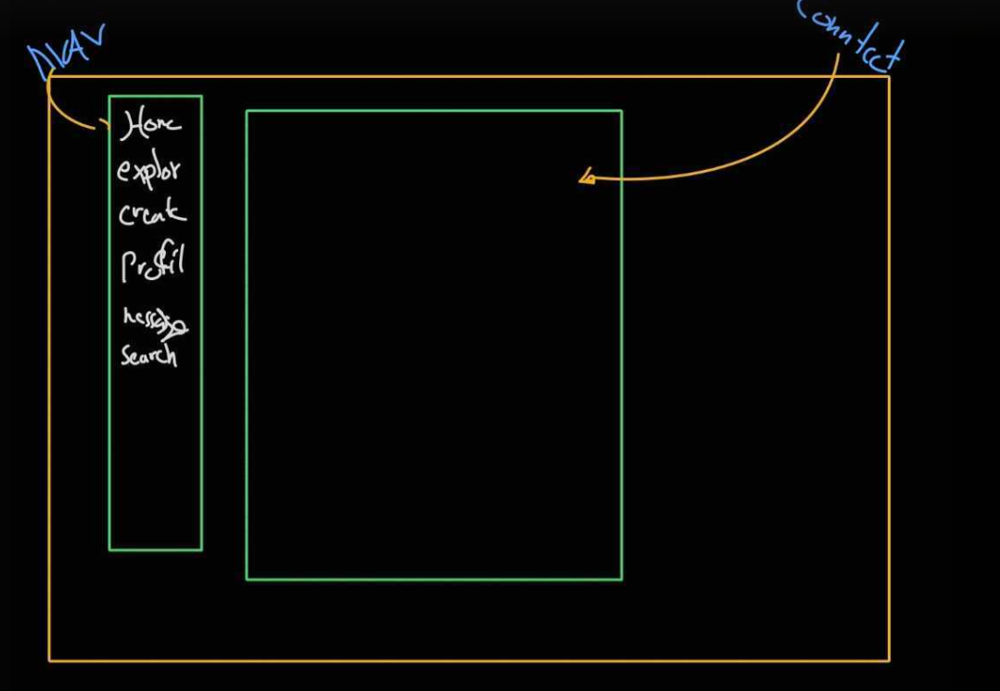

<h1>
  social-media
</h1>

**By:**  Kawthar Mohammad | Malak Jasim | Jawad Hassan | 
**Date:** July / 17/ 2025 

**[GitHub](https://github.com/Kawthara-M)** |
**[LinkedIn](www.linkedin.com/in/kawthar-ahmad-331658361)**

## Description
A Social Media Website, Where Users Can Post, Communicate, And Navigate Withen Different Sections Withen The App.

## Getting Started
| Deployed version of **[Cat-ch-It](https://cat-ch-it.surge.sh/)** |

xxx

## Technologies Used

- MEN STack

## User Stories

xxx

## Wireframes

**Start Preview**
 

**Arena Preview**
 

### **Future Updates**
---

- More responsiveness to different devices
- Audio to livesh the game

### **Credits**
---
##### Images: [Flaticon](https://www.flaticon.com/search?word=cat)

##### Dark Theme Guide: [FreeCodeCamp](https://www.freecodecamp.org/news/how-to-detect-a-users-preferred-color-scheme-in-javascript-ec8ee514f1ef/)

##### Paw Movement Guide: [MDN Web Docs](https://developer.mozilla.org/en-US/docs/Web/CSS/transform-function/translateX)

##### Touch Events Handlers Guide: [W3School](https://www.w3schools.com/jsref/event_touchstart.asp)

