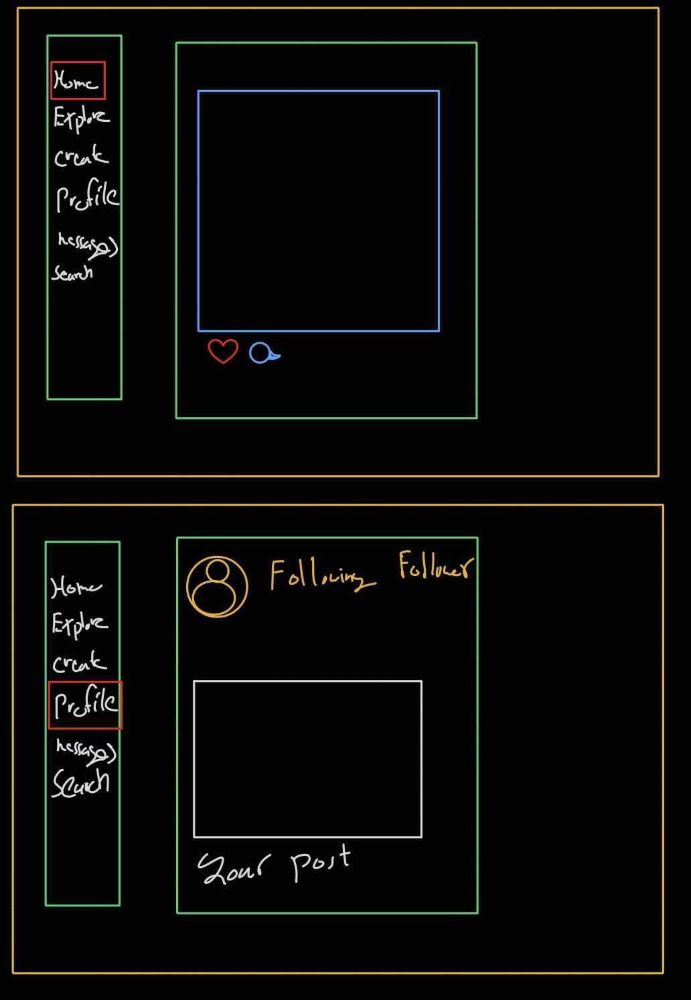
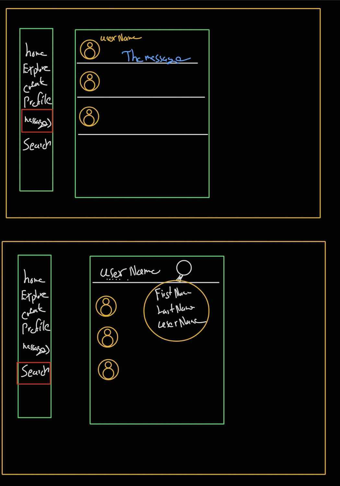

# Social Media

**Date:** July / 17/ 2025  
**By:** [Kawthar Mohammad](https://github.com/Kawthara-M) | [Malak Jasim](https://github.com/Malak1805) | [Jawad Hassan](https://github.com/Jawad-Hassan-J)

## Description

'Wave', a platform designed to simulate a social media expirence, where users can post, interact with other posts, and follow others. Wave is an application of MEN Stack, implemented to demonstrate back-end development skills following MVC architectural pattern. 
-- include image--

## Getting Started

To facilitate the development, several resources were generated throught the planning phase:

- Entity Relationship Diagram (ERD): A diagram created to guide the development of schemas. |
  [LucidChart](https://lucid.app/lucidchart/fe839a3d-ab38-4a1d-9f2b-ba8260569b1e/edit?viewport_loc=-573%2C93%2C1993%2C753%2C0_0&invitationId=inv_5c614da6-8cad-484f-adae-d3aa8441852f) |
- Collaborative Board: A board shared among team memebers to assign tasks and track prograss. | 
[Trello Board](https://trello.com/invite/b/6878ea401d81c643973da674/ATTI68ab95fd58f27aeffe35be35fc66d27f6F816D14/social-media-trello) |

Upon the planning, development started and resulted in:

| Deployed version of **[wave]()** |

## Technologies Used

- MongoDB, Express, Node.js (MEN Stack)
- CSS

## User Stories

- New User will sign-up and will provide the following input fields (username, email, password, birthday, ), if all fields validated, 
The new user will be created and stored in the datebase, if not an error message will be displayed.

- Existing user will sign-in by entering the sign-in credentials, if the credential are correct and exist in the database, the user can start user session and will be redirected to the profile page if not an error message will be displayed.

- The signed-in user can add and submit a new post, the post will than saved in the database with the user Id, updating the homepage with the new post, as well as the option to delete it and to Sign out.

- The user can like other posts and add comments as well.

- If the user types in the search bar, it will display matching usernames in the database, if not it will not display anything.

- In the user's profile, it will display the user's profile image, bio, and posts, also it will provide edit profile option to the user.

## Wireframes
**Home & Profile Previews**
 

 

**Private Message & Search Previews**
 

### **Future Enhancements**

- Displaying other user's stories in the homepage
 - Adding a private chat to the users to interact
  - Adding following and followers feature

### **Attributions**
[bootstrap](https://getbootstrap.com/) |
[W3Schools](https://www.w3schools.com/) |
[Figma](https://www.figma.com/)
---
